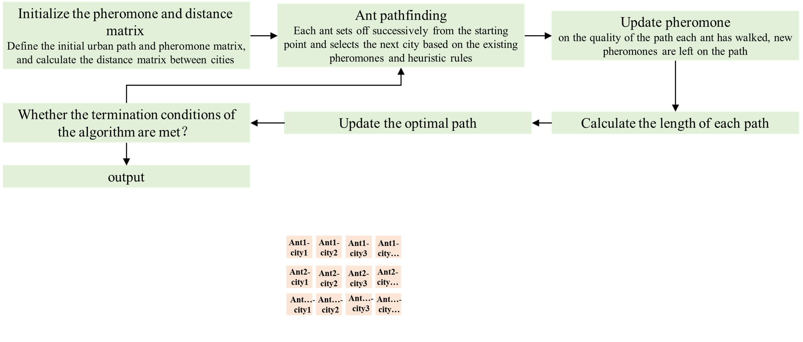
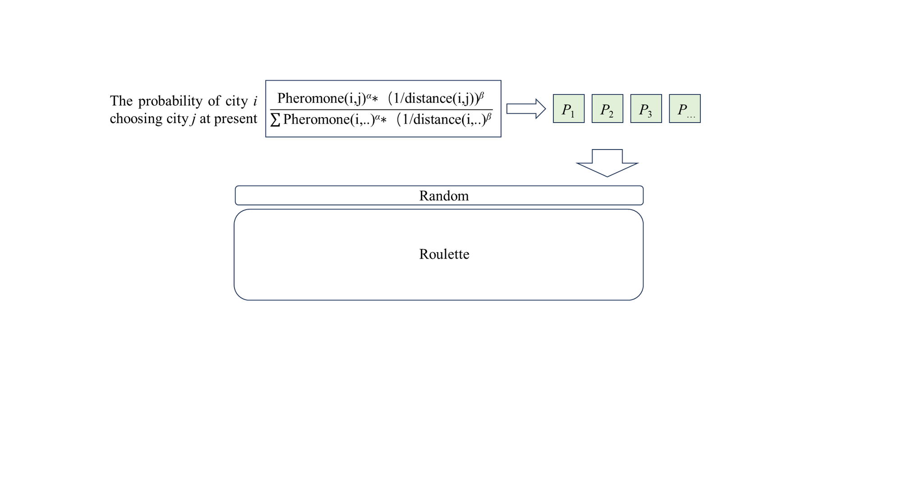
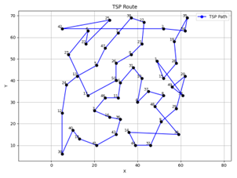
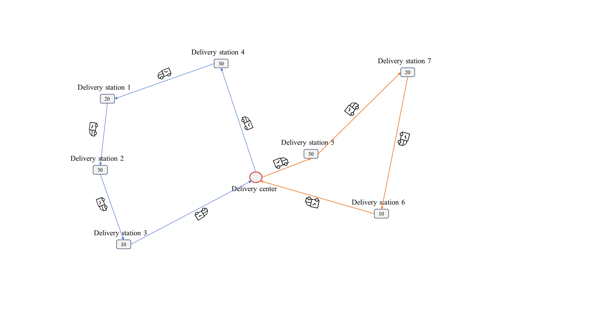
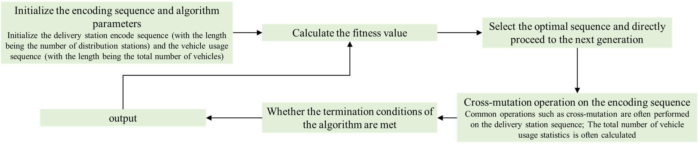
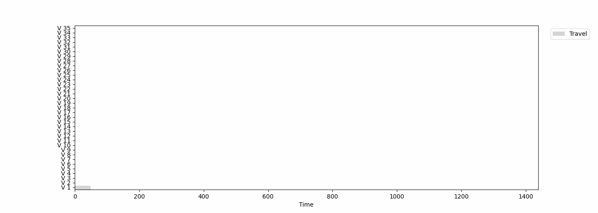

# The solution for TSP and VRP by heuristics

This is about the practice of optimization algorithms for solving the traveling salesman problem (TSP) and the vehicle routing problem (VRP). The aim is to output the solution methods for the above two problems. The following will be introduced in two parts, namely the **TSP** and the **VRP**. Each section will first introduce the problem description, the provided algorithm, and the results of some experimental instances.

## TSP

● ***Problem description***: A commodity salesman is going to several cities to promote products. The salesman sets off from one city and needs to pass through all the cities before returning to the starting point. How should the route be chosen to minimize the total travel distance?

● ***Algorithm approach***: The Ant Colony Optimization (ACO) algorithm is used for solution. The basic algorithm steps are shown in the follows. 

● ***Key points include***: 1.The probability of a city being selected is determined by both distance and pheromone concentration; 2. Pheromone update.

● ***The parameters included in the ACO algorithm***: the information heuristic factor *α*, the importance function factor *β* and information volatilization factor rho. The larger the value of *α* is, the greater the possibility that the ant will choose the route it has taken before. However, if it is too large, the search will fall into the local minimum solution too early. The larger the *β* value is, the greater the possibility that the ant will choose the city close to it.

● ***The addition design of this algorithm***:

1. *The improvement of the next city chosen by ants*:

2. *Improvement of the neighborhood search method*:

● ***Experimental results***

The roadmap for solving Problem (*size:50*)

## VRP

● 	***VRP description***: The vehicle routing problem refers to a certain number of customers each having different quantities of goods demands. The distribution center provides goods to the customers, and a fleet is responsible for distributing the goods and organizing appropriate driving routes. The goal is to meet the customers’ demands and, under certain constraints, achieve goals such as the shortest distance, the lowest cost, and the least time consumption.

● ***The description of the studied problem***: The vehicle routing problem with time windows (CVRPTW) is a representative type of combinatorial optimization problem. This problem requires that on the premise of meeting the service time requirements and vehicle capacity limitations, the distribution routes of vehicles be reasonably arranged, so as to minimize the number of vehicles used and their total driving distance. The schematic diagram is shown as follows

● ***The constraints considered are as follows***: 1. Each delivery station must and can only be visited once; 2. The total load of each vehicle shall not exceed the given upper limit; 3. Each delivery station must start providing services within its designated service time window; 4. All vehicles depart from the delivery center and eventually return to it.

● ***The objectives are as follows***: 1. Prioritize minimizing the number of vehicles used. 2. Under the premise of a fixed number of vehicles, minimize the total driving distance of all vehicles.

● ***The proposed method***: An improved genetic algorithm (IGA) is proposed. The encoding uses double-layer encoding. Layer A is: delivery station sequence encoding; Layer B is the encoding for the number of vehicles used (0-1 indicates). The basic algorithm steps are shown in the figure.

● ***The decoding scheme is based on the order of delivery stations***. First, idle time blocks are generated for each vehicle and inserted in a manner that satisfies the earliest/latest service times of the delivery stations, while ensuring that the capacity of each vehicle does not exceed the limit.

● ***Experimental results***:

Results by the proposed IGA for the CVRPTW, with the dynamic Gantt chart shown below. (*200 delivery stations and 50 vehicles, iterated 500 times*)

